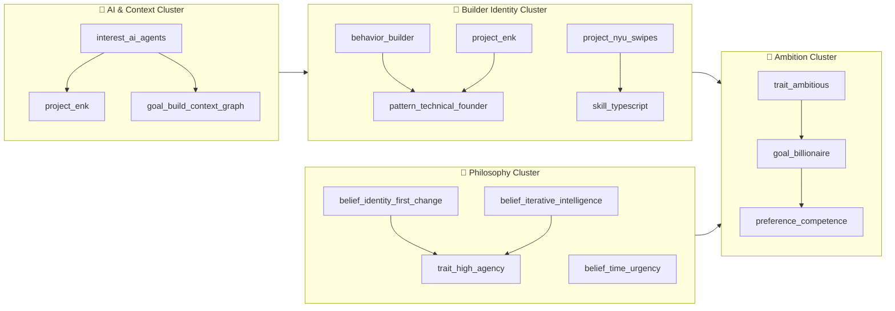
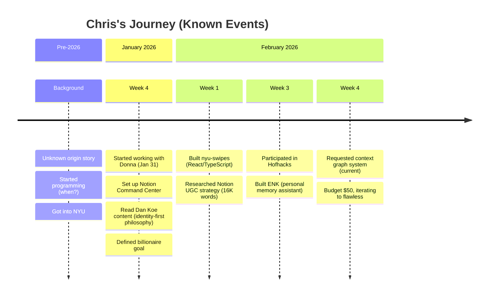
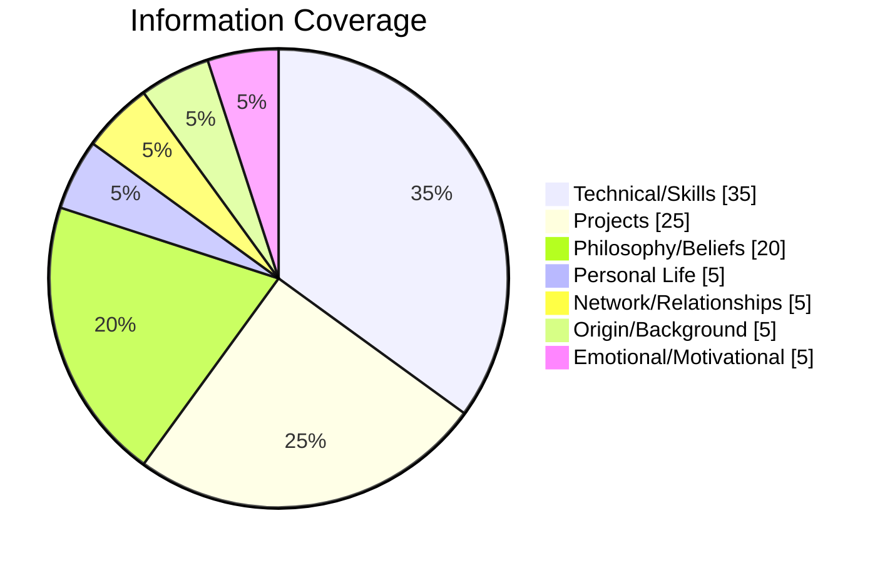

# Context Graph Visualization

## Main Graph

```mermaid
graph TB
    subgraph Identity["🎯 Identity"]
        Chris["Chris Li"]
    end

    subgraph Traits["💎 Core Traits"]
        Ambitious["Ambitious"]
        Direct["Direct Communication"]
        Driven["Driven"]
        HighAgency["High Agency"]
    end

    subgraph Goals["🎪 Goals"]
        Billionaire["Billionaire"]
        ContextGraph["Build Context Graph"]
    end

    subgraph Skills["🛠️ Skills"]
        TypeScript["TypeScript"]
        React["React"]
        Electron["Electron"]
        AIIntegration["AI Integration"]
        BizStrategy["Business Strategy"]
    end

    subgraph Projects["🔨 Projects"]
        NYUSwipes["NYU Swipes"]
        ENK["ENK"]
        NotionPitch["Notion UGC Pitch"]
    end

    subgraph Beliefs["💭 Beliefs"]
        IdentityFirst["Identity-First Change"]
        Iterative["Iterative Intelligence"]
        TimeUrgency["Time Urgency"]
        SystemsGoals["Systems > Goals"]
    end

    subgraph Interests["⭐ Interests"]
        AIAgents["AI Agents"]
        ContextMemory["Context/Memory Systems"]
        PersonalDev["Personal Development"]
    end

    subgraph Context["📍 Context"]
        NYU["NYU"]
        CollegeStudent["College Student"]
        Early20s["Early 20s"]
        TechFounder["Technical Founder"]
    end

    Chris --> Ambitious
    Chris --> Direct
    Chris --> Driven
    Chris --> HighAgency
    Chris --> Billionaire
    Chris --> ContextGraph
    Chris --> TypeScript
    Chris --> React
    Chris --> Electron
    Chris --> AIIntegration
    Chris --> NYUSwipes
    Chris --> ENK
    Chris --> NotionPitch
    Chris --> IdentityFirst
    Chris --> Iterative
    Chris --> TimeUrgency
    Chris --> SystemsGoals
    Chris --> AIAgents
    Chris --> ContextMemory
    Chris --> PersonalDev
    Chris --> NYU
    Chris --> CollegeStudent
    Chris --> TechFounder

    NYUSwipes --> TypeScript
    NYUSwipes --> React
    NYUSwipes --> NYU
    ENK --> Electron
    ENK --> AIIntegration
    ENK --> ContextMemory
    NotionPitch --> BizStrategy
    Billionaire --> Ambitious
    Billionaire --> IdentityFirst
    AIAgents --> ENK
    AIAgents --> ContextGraph
    Iterative --> ContextGraph
    CollegeStudent --> Early20s
    TimeUrgency --> Early20s
    TechFounder --> Ambitious

    classDef identity fill:#e3f2fd,stroke:#1565c0,stroke-width:2px
    classDef trait fill:#f3e5f5,stroke:#7b1fa2
    classDef goal fill:#fff3e0,stroke:#ef6c00
    classDef skill fill:#e8f5e9,stroke:#2e7d32
    classDef project fill:#fce4ec,stroke:#c2185b
    classDef belief fill:#e0f2f1,stroke:#00695c
    classDef interest fill:#fffde7,stroke:#f9a825
    classDef context fill:#efebe9,stroke:#5d4037

    class Chris identity
    class Ambitious,Direct,Driven,HighAgency trait
    class Billionaire,ContextGraph goal
    class TypeScript,React,Electron,AIIntegration,BizStrategy skill
    class NYUSwipes,ENK,NotionPitch project
    class IdentityFirst,Iterative,TimeUrgency,SystemsGoals belief
    class AIAgents,ContextMemory,PersonalDev interest
    class NYU,CollegeStudent,Early20s,TechFounder context
```

## Cluster View

```mermaid
graph LR
    subgraph Builder["🔨 Builder Identity Cluster"]
        B1["behavior_builder"]
        B2["pattern_technical_founder"]
        B3["project_nyu_swipes"]
        B4["project_enk"]
        B5["skill_typescript"]
        B1 --> B2
        B3 --> B5
        B4 --> B2
    end

    subgraph Philosophy["💭 Philosophy Cluster"]
        P1["belief_identity_first_change"]
        P2["belief_iterative_intelligence"]
        P3["belief_time_urgency"]
        P4["trait_high_agency"]
        P1 --> P4
        P2 --> P4
    end

    subgraph Ambition["🚀 Ambition Cluster"]
        A1["trait_ambitious"]
        A2["goal_billionaire"]
        A3["preference_competence"]
        A1 --> A2
        A2 --> A3
    end

    subgraph AIContext["🤖 AI & Context Cluster"]
        C1["interest_ai_agents"]
        C2["project_enk"]
        C3["goal_build_context_graph"]
        C1 --> C2
        C1 --> C3
    end

    Builder --> Ambition
    Philosophy --> Ambition
    AIContext --> Builder
```

## Timeline View

```mermaid
timeline
    title Chris's Journey (Known Events)
    
    section Pre-2026
        Background : Unknown origin story
                   : Started programming (when?)
                   : Got into NYU
    
    section January 2026
        Week 4 : Started working with Donna (Jan 31)
               : Set up Notion Command Center
               : Read Dan Koe content (identity-first philosophy)
               : Defined billionaire goal
    
    section February 2026
        Week 1 : Built nyu-swipes (React/TypeScript)
               : Researched Notion UGC strategy (16K words)
        
        Week 3 : Participated in Hofhacks
               : Built ENK (personal memory assistant)
        
        Week 4 : Requested context graph system (current)
               : Budget $50, iterating to flawless
```

## Knowledge Gap Visualization

```mermaid
pie showData
    title Information Coverage
    "Technical/Skills" : 35
    "Projects" : 25
    "Philosophy/Beliefs" : 20
    "Personal Life" : 5
    "Network/Relationships" : 5
    "Origin/Background" : 5
    "Emotional/Motivational" : 5
```
